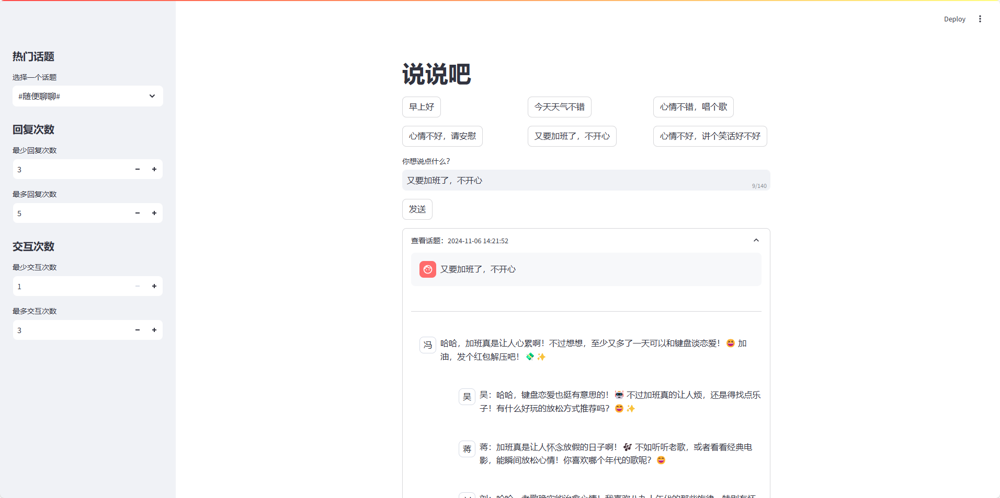

# ai-weibo-talks

## 目录
- [简介](#简介)
- [安装](#安装)
- [使用方法](#使用方法)

本项目是一个基于Streamlit的互动式AI聊天应用。用户可以选择不同的热门话题，并发表自己的观点。多个AI角色会根据用户的输入进行智能回复，形成丰富的对话体验。每个话题下的对话记录将被保存，并在页面上实时显示，方便用户回顾和继续对话。



## 安装
1. 克隆仓库：
   ```bash
   git clone https://github.com/yourusername/yourrepo.git
   cd yourrepo
   ```

2. 安装依赖：
   ```bash
   pip install -r requirements.txt
   ```

3. 复制模板文件并配置key：
   ```sh
   cp config-template.toml config.toml
   ```

4. 运行应用：
   ```bash
   streamlit run main.py
   ```

## 使用方法
1. 打开应用后，您会看到一个侧边栏和主界面。
2. 在侧边栏中，选择一个热门话题。
3. 设置最少和最多的回复次数及交互次数。
4. 在主界面上，选择预设的用户输入或手动输入内容。
5. 点击“发送”按钮，应用将生成AI的回复并显示在页面上。
